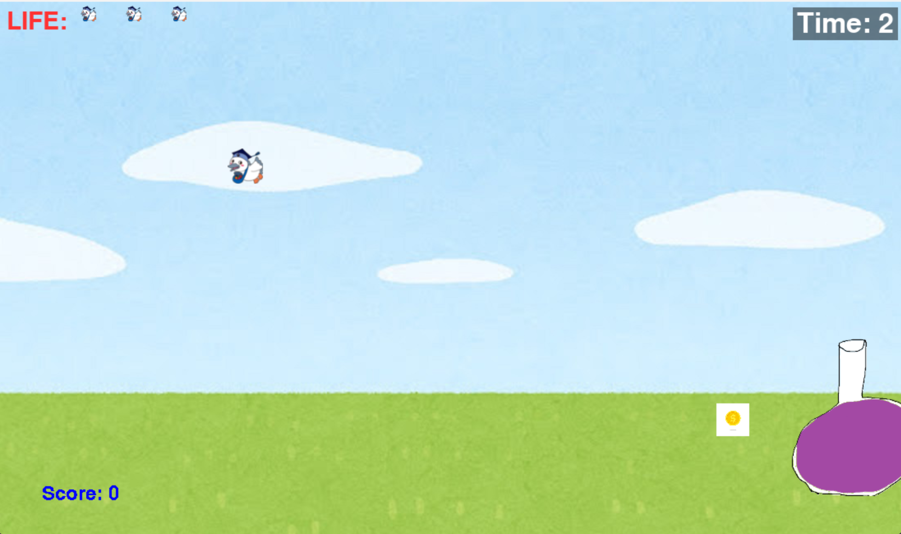

# 落ち物キャッチゲーム

## 実行環境の必要条件
* python >= 3.10
* pygame >= 2.1

## ゲームの概要
* キャラクターを前後してアイテムをゲットし、ポイントを稼ごう

## ゲームの遊び方
* 矢印キーで前後の操作
* 落ちてくるアイテムに当たるとポイントゲット

## ゲームの実装
### 共通基本機能
* 背景画像,
* キャラクターの描画
* キャラクターの移動

### 分担追加機能
* アイテムの落下　(担当:横瀬)
* アイテムとキャラクターの当たり判定　(担当:)
* マイナスアイテム追加 (担当: 栗林)
* コンボ機能
* 生存時間の描画　(担当：小関)
* ライフの追加 (担当:中島)
* スコアの追加 (担当:横瀬)

